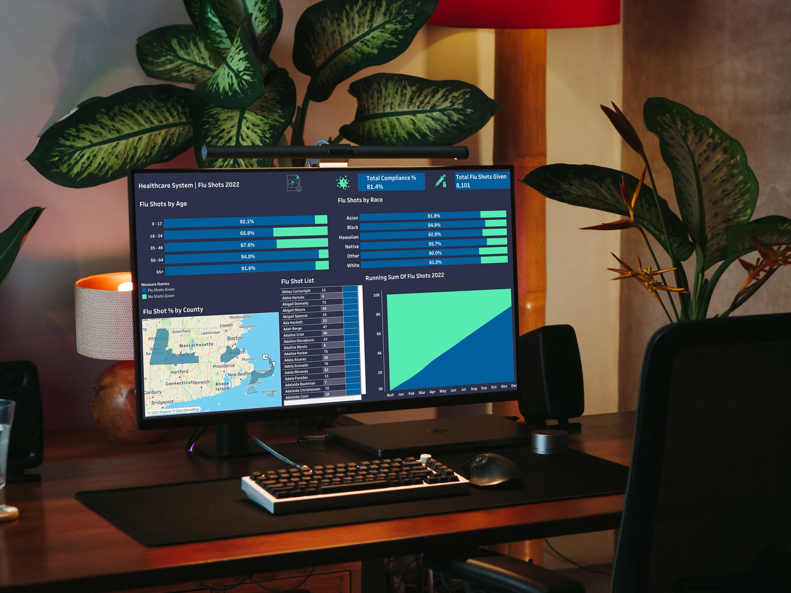

# healthcare

## 1) Project Background

As a **Data Analyst at Havenhill Regional Hospital**, I support clinical and administrative teams by turning healthcare data into actionable insights that improve patient outcomes and hospital operations. 

In 2022, the hospital prioritized increasing uptake of the **seasonal influenza (flu) vaccine**—a critical preventive measure for high-risk populations including the elderly, young children, and individuals with chronic illnesses.

To aid this public health effort, I was tasked with building a **Seasonal Flu Vaccination Dashboard** using our internal hospital data. This dashboard would visualize:
- Vaccination trends over time
- Coverage across different demographics
- Geographic distribution across counties
- A full patient-level breakdown of those who received or missed the flu shot

This project utilized:
- **SQL Server** for data extraction and transformation  
- **Tableau** for interactive data visualization

The resulting dashboard is now a central resource used by Havenhill’s medical directors and community outreach teams to identify underserved groups, evaluate performance, and drive targeted vaccination efforts.

## 2) Data Structure

The data for this project was extracted from Havenhill Regional Hospital’s internal relational database, which follows a normalized structure. Below is an overview of the key tables used:

### Core Tables

- **Patients**
  - Contains demographic details such as name, birth date, race, county, and death date.
  
- **Encounters**
  - Records patient visits to the hospital, including start and stop times.

- **Immunizations**
  - Logs administered vaccines, with codes identifying the vaccine type (e.g., flu shots use code `5302`).

### ERD (Entity Relationship Diagram)

## 3) Executive Summary

This report empowers hospital leadership to make data-informed decisions for improving outreach and achieving public health targets.

### 🖼️ Dashboard Snapshot  

🔗 **[View Interactive Tableau Dashboard](https://public.tableau.com/views/ImmunizationDashboard_17157938691190/Dashboard1?:language=en-US&:sid=&:redirect=auth&:display_count=n&:origin=viz_share_link)**

---

### 🧠 Key Insights

- **Total Flu Shots Administered**  
  A total of **8,101** flu shots were given to eligible patients, reflecting strong hospital engagement in public health.

- **Overall Compliance Rate**  
  **81.4%** of active patients received their flu shots in 2022, indicating high awareness and access to immunizations.

- **Vaccination by Age Group**  
  - Ages **0–17** and **50–64** had the **highest compliance** (92.1% and 94%), possibly due to school requirements and senior care initiatives.  
  - Ages **18–49** showed **lower uptake**, highlighting an opportunity for targeted awareness campaigns among younger adults.

- **Vaccination by Race**  
  Compliance was **consistently above 80%** across all racial groups, with **Native Americans (85.7%)** and **Black patients (84.9%)** having the highest rates.

- **Vaccination by County**  
  Counties like **Barnstable** (82.5%) and **Berkshire** (82.3%) led in compliance, while **Dukes** and **Nantucket** (80%) show room for slight improvement through localized outreach.

  ## 4) Recommendations

Based on the analysis of flu shot compliance at **Havenhill Regional Hospital**, the following actions are recommended to improve future immunization efforts:

1. **Target Awareness for Young Adults (18–49)**  
   Launch focused educational campaigns and workplace initiatives for patients aged 18–49, who showed the lowest flu shot compliance. Highlight risks of skipping annual vaccines even for healthy adults.

2. **Outreach in Lower-Compliant Counties**  
   While county-level compliance was relatively even, **Dukes** and **Nantucket** had the lowest uptake (80%). Consider deploying mobile clinics or community partnerships in these areas to improve access.

3. **Earlier and Sustained Campaign Rollout**  
   Initiate flu shot awareness and scheduling at the **start of Q3**, allowing patients time to plan appointments. Pair this with reminder systems via SMS or patient portals.

4. **Collaborate with Community Leaders**  
   Partner with schools, local churches, and elder care centers to drive uptake in both the youth and senior demographics—especially leveraging success seen in the 0–17 and 50+ age groups.
